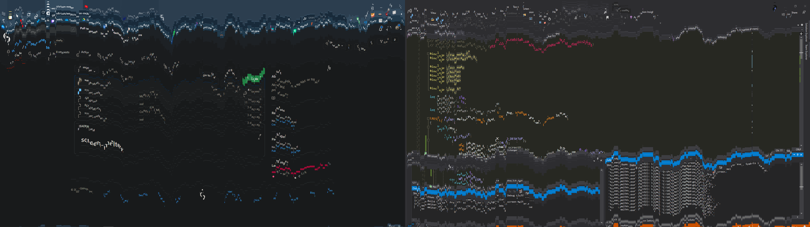

# screen-melter

The project is based on [Napalm's code](http://www.rohitab.com/discuss/topic/23191-screen-melter/?p=190669).
It also implements **multi-monitor support** and **DPI awareness**.

### Args:

| Arg                        | Type     | Description                                                                                   |
| -------------------------- | -------- | --------------------------------------------------------------------------------------------- |
| `-t`, `--time`             | `number` | Delay before visual effect starts (**ms**)                                                    |
| `-e`, `--exit_time`        | `number` | The program will automatically exit after this amount of time (**ms**)                        |
| `-I`, `--disable_input`    | `flag`   | Disables keyboard and mouse input, `ctrl+alt+del` still works                                 |
| `-K`, `--disable_keyboard` | `flag`   | Disables keyboard input, `ctrl+alt+del` still works                                           |
| `-M`, `--disable_mouse`    | `flag`   | Disables mouse input                                                                          |
| `-k`, `--kill_explorer`    | `flag`   | Kills all explorer.exe processes and restarts the root (desktop) process on application exit  |
| `-T`, `--topmost`          | `flag`   | Runs window always on top                                                                     |
| `-B`, `--start_on_boot`    | `string` | The program will launch with provided args on next boot                                       |

### Usage

- `screen-melter.exe -M --disable_keyboard -t 20 --exit_time=10000`
- `screen-melter.exe -B "-t 2000 --exit_time=10000"`

### Requirements

[Microsoft Visual C++ Redistributable](https://learn.microsoft.com/en-us/cpp/windows/latest-supported-vc-redist?view=msvc-170#visual-studio-2015-2017-2019-and-2022)

### License

This project is licensed under the MIT License - see the [MIT License](LICENSE) file for details.
